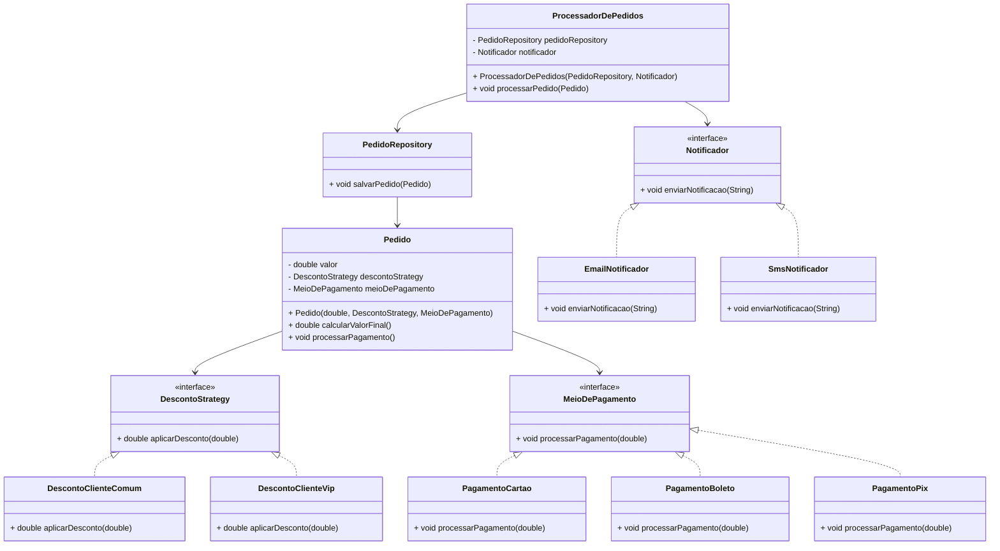

# Sistema de Gestão de Pedidos - SOLID

Este projeto implementa um sistema de gestão de pedidos para um e-commerce, seguindo os princípios SOLID para garantir um design de software bem estruturado, flexível e extensível.

## Funcionalidades

- Criar e processar pedidos.
- Aplicar descontos baseados no tipo de cliente.
- Enviar notificações quando um pedido for concluído.
- Registrar os pedidos em um banco de dados.
- Adicionar meios de pagamento (Cartão, Boleto, Pix) utilizando padrões de projeto.

## Princípios SOLID Aplicados

1. **Princípio da Responsabilidade Única (SRP):** Cada classe tem uma única responsabilidade bem definida.
2. **Princípio Aberto-Fechado (OCP):** É possível adicionar novos tipos de descontos e meios de pagamento sem modificar o código existente.
3. **Princípio da Substituição de Liskov (LSP):** Substituição de subclasses ocorre sem impactar o funcionamento do sistema.
4. **Princípio da Segregação de Interfaces (ISP):** Interfaces bem definidas evitam métodos desnecessários em algumas classes.
5. **Princípio da Inversão de Dependência (DIP):** O sistema depende de abstrações, não de implementações concretas.

## Estrutura do Código

- `Pedido` - Representa um pedido no sistema.
- `DescontoStrategy` - Interface para estratégias de desconto.
- `DescontoClienteComum` e `DescontoClienteVip` - Implementações de desconto.
- `Notificador` - Interface para notificação.
- `EmailNotificador` e `SmsNotificador` - Implementações de notificação.
- `MeioDePagamento` - Interface para meios de pagamento.
- `PagamentoCartao`, `PagamentoBoleto` e `PagamentoPix` - Implementações de pagamento.
- `PedidoRepository` - Responsável por salvar pedidos no banco de dados.
- `ProcessadorDePedidos` - Gerencia a criação e finalização de pedidos.

## Diagrama UML

## Contribuição

Sinta-se à vontade para contribuir com melhorias ou sugerir novas funcionalidades! Abra uma issue ou envie um pull request.

## Licença

Este projeto está sob a licença MIT.

